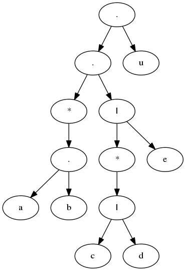
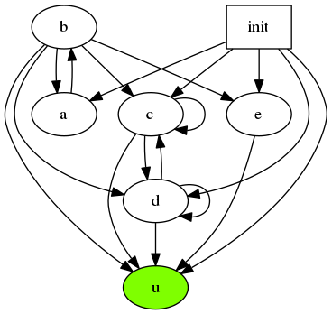

[中文版](examples-cn.md) [English](examples.md)

使用方法很简单，先到src下make，生成libregex_internal.so，然后就可以根据需要使用各个模块了。

包含的三个主要模块分别是parser，compiler，matcher，使用范例可以在unit文件夹下找到，为了方便使用者了解内部结构/debug，parser和compiler都提供了visualization工具，在每一次根据输入的rule得到的parse ast / compile nfa后，都可以调用traverse方法生成graph.dot/nfa_graph.dot。 通过dot 工具得到可视化的一些regex形式。

下面通过简单的例子示范一下使用流程：

```c++
// specify your rule
char regex[] = "(ab)*((c|d)*|e)u";
int length = strlen(regex);

// Parse rule into AST
AST ast(regex, length);
// visualize ast
ast.traverse();

// Compile rule (AST) into GlushKov NFA
GlushKov_NFA NFA(&ast);
// visualize nfa
NFA.traverse();
```

读者可以尝试构造一下这个rule对应的ast以及nfa长什么样：

```
// 运行上述代码后，在工作目录下会出现 graph.dot 和 nfa_graph.dot
// 运行以下命令得到png
dot -Tpng graph.dot -o ast.png
dot -Tpng nfa_graph.dot -o nfa.png
```
AST 可视化：



NFA 可视化(init为初始状态，标记有绿色的节点为final state)：

